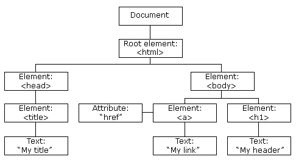

## Introduction

This document outlines a process for extracting and tidying up data from the HTML source of a company's Google reviews. The purpose of this document is to outline the process end-to-end and provide code for general use.

```{r setup, include=FALSE}
# in case you don't have these installed
if (!require("tidyverse")) install.packages("tidyverse")
if (!require("rvest")) install.packages("rvest")
if (!require("xml2")) install.packages("xml2")
if (!require("tidytext")) install.packages("tidytext")
if (!require("stringr")) install.packages("stringr")
if (!require("pbapply")) install.packages("pbapply")
if (!require("kableExtra")) install.packages("kableExtra")

# load libraries
library(tidyverse)
library(rvest)
library(xml2)
library(tidytext)
library(stringr)
library(pbapply)
library(kableExtra)
```

## Download Reviews

Here is the process you need to follow if you want to download the HTML source that contains all of the reviews you are looking to process:

1. Go to the Google reviews page for the company
2. Scroll through all of the reviews, then scroll back up. This loads all the reviews from the Google server into your browser
3. Right click on the first review > Click "Inspect"
4. Hover over the elements and look for the one that highlights all of the reviews
5. Right click on the element > Select "Edit as HTML"
    


6. New sub-window opens up with the HTML text.
7. Click into the text and press CTRL+A to select everything then CTRL+C to copy
8. Paste the text into a text editor (not word, I use Atom) and save it as <filename>.html in your R project folder

Once you have that .html file saved, we can now load it into R and process the data. You could also just download the entire web page html source if you want data from somewhere other than the reviews.

## Read and Process the Downloaded HTML document in R

### Goals of this Section:

1. Extract reviews from the downloaded HTML each into its own HTML node (one node per review)
2. Extract relevant data from each HTML node
3. Format and combine the extracted data from each review node into a single dataframe

### Creating Review Nodeset

An HTML node is a connected group of HTML that shares the same root. Nodes can have parents and children whose relationships are defined by their hierarchy in this tree of HTML. The collapsable arrows in the above image where we saved HTML are used there to show/hide the child nodes Here's a graphical example of an HTML document node with two children nodes:



To extract all the reviews each into its own element of a list, we need to use an XPATH selector to select each one. XPath can be used to navigate through elements and attributes in an XML document. The HTML we downloaded is organized into an XML document. Just to be clear, HTML is a language used to create webpages. XML is not a language, rather it's a method of structuring and organizing a document. So using this XML framework we will select for the HTML that we want. XPath is basically a description of where elements are located in this tree.

Rather than having to learn how to write XPaths specific to this HTML node tree, I used a Chrome plugin call SelectorGadget. Enable the plugin by clicking on the plugin icon in your toolbar and hover over the element you want to extract. Once you see that your element is highlighted, click on it. It should become green, with other elements showing yellow. Green elements are the ones you have explicity selected for, and yellow elements are also included in your selection, but can be removed by clicking on them if you don't want them as part of your XPath. Here is an example:


Click the "XPath" button to copy the XPath to use in the extraction code below:

```{r HTML Process}
# read in the html
reviews_html = xml2::read_html("data/KenGarffHondaOfOrem-GoogleReviews.html")

# XPATH for reviews
REVIEW = '//*[contains(concat( " ", @class, " " ), 
          concat( " ", "gws-localreviews__google-review", " " ))]'

reviews_nodeset = reviews_html %>% 
  rvest::html_nodes(xpath = REVIEW)
```

`reviews_nodeset` is a xml_nodeset with 745 elements. Since there were 745 total reviews at the time of downloading it, I now have each review in its own element. The purpose for doing this is to be able to write a function that will extract data from a node (review), which we will apply to each element in the nodeset, much like a `mutate` call in dplyr.

### Extracting Data Fields

Here are the fields that we want to extract from each review nodes.

Columns:
	Reviewer Variables: 
		Reviewer Name: Character 
		Local Guide Flag: Boolean (whether or not the reviewer is a Local Guide)
		Number of Reviews: Integer
		Number of Photos: Integer
	Review Variables:
		Stars: Integer
		Review Text: Character
		Likes: Integer
		How Long Ago: Character (we can’t use a date format here since we get approximate times)
		Responded to: Boolean
	Response Variables:
		Response Text: Character
		How Long Ago: Character
		
Below are several functions we will use to extract this data from each child node. Instead of using XPaths to extract the data from individual nodes, we use css selectors. [**Here is some info on selectors**](https://www.w3schools.com/csSref/css_selectors.asp). You can get the css selector names using the SelectorGadget plugin, or by just looking at the the class names in the html source.

All of these functions return a named list that we can transform into a dataframe later.

```{r Extraction Function}
# helper function
ifNoneThenZero = function(x) {
  x = suppressWarnings(as.numeric(x))
  ifelse(is.na(x), 0, x)
}

getName = function(node) {
  reviewerName = node %>% 
    xml_child(1) %>% 
    xml_child(1) %>% 
    xml_attrs() %>% 
    .[["alt"]]
  
  list(reviewerName = reviewerName)
}

getReviewText = function(node) {
  reviewText = node %>% 
    html_node('.review-full-text')
  
  if(length(reviewText) == 0) {
    reviewText = node %>% 
      html_node('.Jtu6Td')
    list(reviewText = xml_text(reviewText))
  } else {
    list(reviewText = xml_text(reviewText)) 
  }
}

getReveiwerData = function(node) {
  reviewerData = node %>% 
    html_node('.A503be') %>% 
    xml_text()
  
  list(isLocalGuide = grepl("Local Guide", reviewerData),
       reviews = ifNoneThenZero(str_extract(reviewerData, "([0-9]+)(?= review)")),
       photos = ifNoneThenZero(str_extract(reviewerData, "([0-9]+)(?= photo)")))
}

getRating = function(node) {
  rating = suppressWarnings({
    node %>% 
    html_node(".Fam1ne.EBe2gf") %>% 
    html_attr("aria-label") %>% 
    str_extract("(?!Rated )([0-9.]+)") %>% 
    as.numeric(.)})
  
  list(rating = rating)
}

getTimeReviewed = function(node) {
  timeReviewed = node %>% 
    html_node(".dehysf") %>% 
    xml_text()
  
  list(timeReviewed = timeReviewed)
}

getLikes = function(node) {
  likes = suppressWarnings({
    node %>% 
      html_node(".QWOdjf.i8w0muTVe_Wg-ekHcgmb48aU") %>% 
      xml_text() %>% 
      ifNoneThenZero()
  })
  
  list(likes = likes)
}

getResponseData = function(node) {
  responseNodes = node %>% 
    html_node('.LfKETd') %>% 
    xml_contents()
  
  if(length(responseNodes) == 2) {
    list(responseTime = responseNodes[[1]] %>% xml_child(3) %>% xml_text(),
         responseText = responseNodes[[2]] %>% xml_text()) 
  } else {
    list(responseTime = NA,
         responseText = NA)
  }
}
```

### Format and Combine

Now that we have all of our extractor functions, we will now create a function that calls all of our extractors and appends all of the output lists into one list. I use `pblapply` here instead of `map` or `lapply` to speed up the data extraction with parallel processing. After we apply this function to our `reviews_nodeset`, we will then call `bind_rows()` on the output list to transform it into a dataframe.

```{r extractGoogleReviewData}
extractGoogleReviewData = function(node) {
  list(getName(node),
       getReviewText(node),
       getReveiwerData(node),
       getRating(node),
       getTimeReviewed(node),
       getLikes(node),
       getResponseData(node)) %>% 
    reduce(append) %>% 
    bind_cols()
}

extractedData = pblapply(reviews_nodeset, extractGoogleReviewData, cl = 20) %>% bind_rows()
```

## Conclusion

```{r output, echo = FALSE}
library(knitr)
extractedData %>% 
  head(6) %>% 
  kable(caption = "Sample Output of extractedData") %>% 
  kable_styling(full_width = FALSE, font_size = 4.5, position = "left") %>% 
  column_spec(2, width = "1cm", monospace = FALSE) %>% 
  column_spec(2, width = "3cm", monospace = FALSE) %>% 
  column_spec(10, width = "2cm", monospace = FALSE)
```

That's it! Now we have all of our data in a tidy format fit for analysis. This process and these functions can be used to extract data from other companies' Google reviews, although they may break if Google ever changes it's page structure or renames the classes. Web scraping is pretty finicky, so any code used to scrape sites will need to be maintained and updated pretty regularly. Also, it's against Google's terms of service to scrape their site using automated tools. This code does not break their TOS since we actually visited the site ourselves and scrolled through the reviews instead of writing a script to do it for us (which you can do, although you'll likely have your IP blocked from visiting Google if you do it too much).
